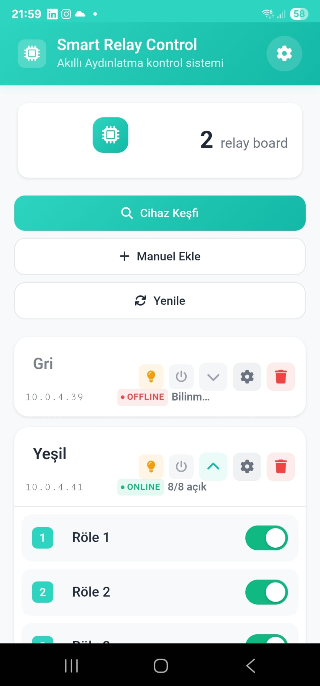
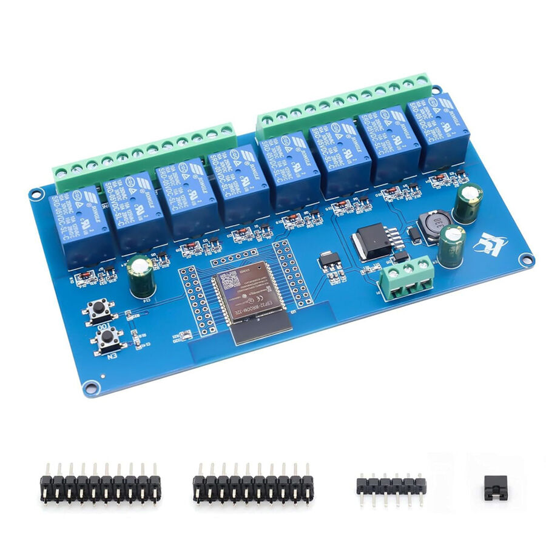
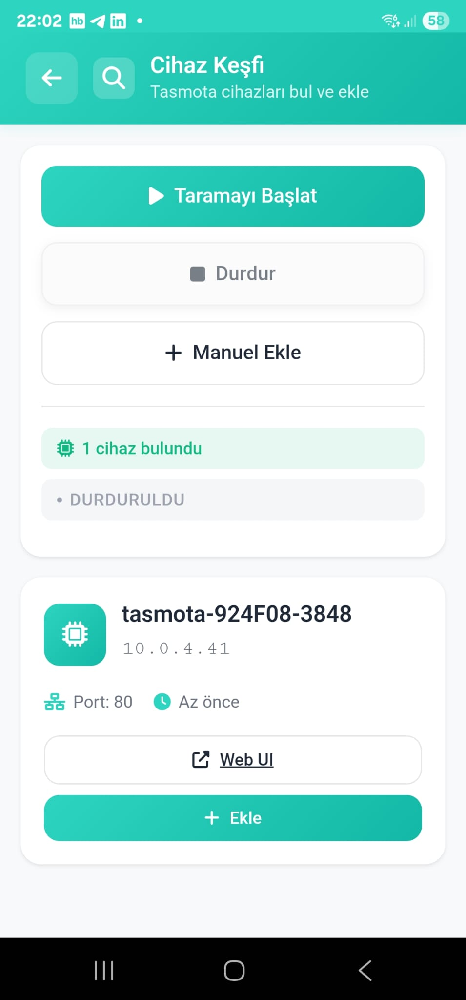
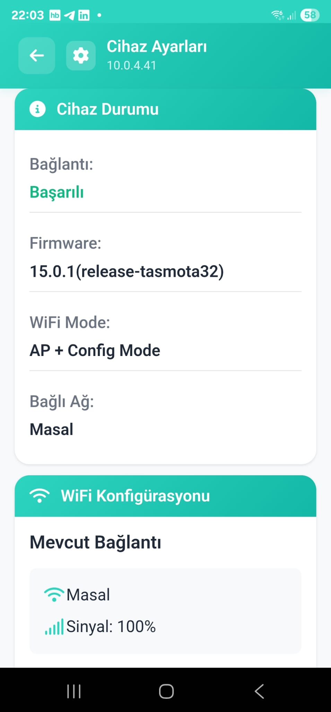
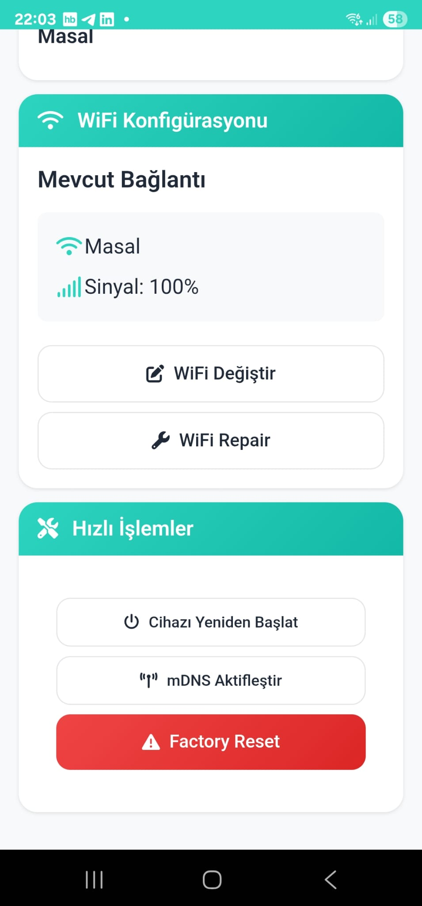
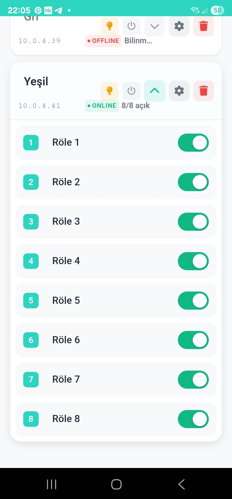
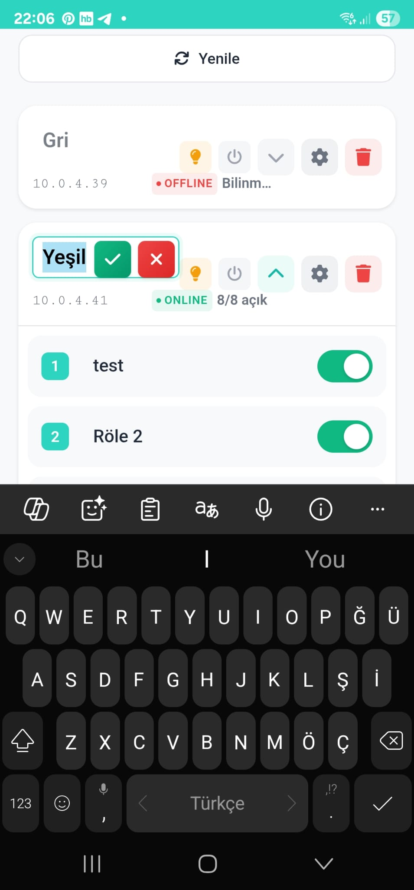

# Smart Lighting Control App

A modern .NET MAUI Blazor application for controlling Tasmota-based relay boards and smart lighting systems. Built with [TasmotaSharp](https://www.nuget.org/packages/TasmotaSharp/) library for seamless device communication.

This application was developed with the goal of creating a stable, robust ESP32 firmware solution for 2-channel and 8-channel relay boards. Tasmota proved to be an excellent choice for this purpose, providing reliable firmware with comprehensive HTTP API support.



## Hardware

The application is designed to work with ESP32-based relay boards, particularly the 8-channel WiFi Bluetooth relay board shown below:



### Recommended Hardware

**ESP32 WiFi Bluetooth 8-Channel Relay Board**
- ESP32-WROOM-32 module
- 8 independent relay channels (supports 2, 4, 6, 8 channel configurations)
- 5V/12V power input
- WiFi & Bluetooth connectivity
- Screw terminals for easy wiring

**Purchase Links:**
- [Direnc.net (Turkey)](https://www.direnc.net/esp32-wifi-bluetooth-8-kanal-role-karti)
- [AliExpress (International)](https://tr.aliexpress.com/item/1005006725015882.html?gatewayAdapt=glo2tur)

**Pin Configuration & Documentation:**
- [Complete Pin Mapping Guide](https://emariete.com/en/esp32-relay-board-x8)

**3D Printable Enclosure:**
- [STL Files for 8-Channel Board](https://makerworld.com/tr/models/374060-esp32-relay-board-cover-8-channel?from=search#profileId-274009)

## Features

- **Device Discovery**: Automatic mDNS discovery of Tasmota devices on your network
- **Multi-Device Management**: Control multiple relay boards from a single interface
- **Real-time Status**: Live monitoring of device connection status and relay states
- **WiFi Configuration**: Easy WiFi setup for new devices, including AP mode support
- **Individual Relay Control**: Toggle individual relays with instant feedback
- **Bulk Operations**: Turn all relays on/off with one tap
- **Device Settings**: Advanced configuration options for each device
- **Responsive Design**: Works seamlessly on mobile and desktop devices

## Screenshots

### Main Dashboard


*The main dashboard showing connected devices and their status*

### Device Discovery


*Automatic discovery of Tasmota devices on the network*

### Device Configuration
<div style="display: flex; gap: 10px; flex-wrap: wrap;">
  
  
</div>

*WiFi configuration and device settings interface*

### Relay Control
<div style="display: flex; gap: 10px; flex-wrap: wrap;">
  
  
  
</div>

*Individual relay control with real-time status updates*
## Why Tasmota?

This application was specifically designed to leverage Tasmota firmware as a stable, robust solution for ESP32-based relay control systems. Here's why Tasmota was chosen:

### Development Goals
- **Stability**: Need for reliable firmware that can handle continuous operation
- **Robustness**: Firmware that recovers gracefully from network issues and power cycles
- **Multi-Channel Support**: Seamless handling of both 2-channel and 8-channel relay configurations
- **HTTP API**: Comprehensive REST API for easy integration
- **Community Support**: Well-documented, actively maintained open-source project

### Tasmota Advantages
- **Proven Reliability**: Years of development and real-world testing
- **Self-Recovery**: Automatic WiFi reconnection and error handling
- **Extensive Features**: Built-in web interface, MQTT, timers, rules engine
- **Hardware Detection**: Automatic relay count detection and GPIO configuration
- **OTA Updates**: Easy firmware updates without physical access
- **mDNS Support**: Network discovery without hardcoded IP addresses

## Technology Stack

- **.NET 9 MAUI Blazor**: Cross-platform mobile and desktop application framework
- **TasmotaSharp**: HTTP-based Tasmota client library ([GitHub](https://github.com/serkansmg/TasmotaSharp))
- **mDNS Discovery**: Automatic device discovery using Bonjour/Zeroconf
- **SQLite**: Local device storage and configuration management
- **Bootstrap CSS**: Modern, responsive UI components

## Getting Started

### Prerequisites

- .NET 9 SDK or later
- Visual Studio 2022 with MAUI workload
- Android/iOS development tools (for mobile deployment)

### Installation

1. Clone the repository:
```bash
git clone https://github.com/your-username/smart-lighting-app.git
cd smart-lighting-app
```

2. Install dependencies:
```bash
dotnet restore
```

3. Run the application:
```bash
dotnet run --framework net9.0-android  # For Android
dotnet run --framework net9.0-ios      # For iOS
dotnet run --framework net9.0-windows  # For Windows
```

## Usage

### Adding New Devices

#### Automatic Discovery
1. Tap **"Cihaz Keşfi"** (Device Discovery) on the main screen
2. Tap **"Taramayı Başlat"** (Start Scanning) to search for devices
3. Select discovered devices and tap **"Ekle"** (Add) to add them to your dashboard

#### Manual Addition
1. Tap **"Manuel Ekle"** (Manual Add)
2. Enter device name and IP address
3. The app will automatically detect relay count and current states

### Controlling Relays

#### Individual Control
- Tap the toggle switch next to each relay to turn it on/off
- Status updates in real-time with visual feedback

#### Bulk Control
- Use the lightbulb icon to turn all relays ON
- Use the power icon to turn all relays OFF

### Device Configuration

1. Tap the settings icon on any device card
2. Configure WiFi settings for new devices
3. Access advanced Tasmota features
4. Restart or reset devices as needed

## TasmotaSharp Integration

This application demonstrates practical usage of the TasmotaSharp library:

```csharp
// Initialize TasmotaClient
var client = new TasmotaClient();
client.SetIp(deviceIpAddress);

// Control relays
await client.SetRelayAsync(1, true);  // Turn relay 1 ON
var state = await client.GetRelayStateAsync(1);

// Device discovery
var relayCount = await client.GetRelayCountAsync();
var status = await client.GetStatusAsync();

// WiFi configuration
await client.SetWifiCredentialsAsync("NetworkSSID", "password");
await client.ScanWifiAsync();
```

### Key Features Used

- **Device Status Monitoring**: Real-time connection status checking
- **Relay Count Detection**: Automatic detection of available relays
- **WiFi Management**: Complete WiFi setup and configuration
- **mDNS Discovery**: Network-based device discovery
- **Bulk Operations**: Efficient multi-relay control

## Architecture

### Project Structure
```
SmartLightingApp/
├── Components/
│   ├── Pages/           # Razor components
│   │   ├── Home.razor
│   │   ├── DeviceDiscovery.razor
│   │   ├── Settings.razor
│   │   └── BoardCard.razor #and other page components
│   ├── Layout/          # Layout components
│   └── CustomComponents/          # Custom Text components
├── Services/
│   ├── RelayDataService.cs      # Data persistence
│   └── TasmotaMdnsDiscoveryService.cs  # mDNS discovery
├── Models/
│   ├── RelayBoard.cs    # Device models
│   └── RelayItem.cs
└── Platforms/           # Platform-specific code
```

### Data Flow
1. **Discovery Service** finds devices via mDNS
2. **TasmotaClient** communicates with devices
3. **Data Service** persists device configuration
4. **UI Components** provide real-time updates

## Language Support

**Current Version**: Turkish interface
**Upcoming**: Multi-language support planned for the next major release, including English, German, and other languages.

The application currently uses Turkish for the user interface, making it ideal for Turkish-speaking users. An internationalization update is planned to support multiple languages.

## Device Compatibility

### Supported Tasmota Devices
- ESP8266/ESP32 based relay boards
- Sonoff devices (Basic, 4CH, T1/T2/T3)
- Generic Tasmota firmware installations
- Custom relay configurations (2, 4, 6, 8 relays)

### Requirements
- Tasmota firmware 8.0+ recommended
- HTTP API enabled (default)
- Network connectivity (WiFi)
- mDNS support for auto-discovery

## Configuration

### Hardware Setup

#### 1. ESP32 Relay Board Setup
1. **Power Connection**: Connect 5V or 12V power supply to the board
2. **Relay Wiring**: Connect your loads (lights, motors, etc.) to relay outputs
3. **Safety**: Ensure proper electrical isolation and follow local electrical codes

#### 2. Tasmota Firmware Installation
1. Flash Tasmota firmware to your ESP32 device
2. Use the provided pin configuration from [emariete.com guide](https://emariete.com/en/esp32-relay-board-x8)
3. Configure GPIO settings for relay outputs

#### 3. Initial WiFi Setup
1. Power on the device - it will create a WiFi hotspot (tasmota-xxxx)
2. Connect to the hotspot and configure your WiFi credentials
3. Enable mDNS for automatic discovery
4. The device will restart and connect to your network

#### 4. Enclosure (Optional)
- Print the 3D enclosure from [MakerWorld STL files](https://makerworld.com/tr/models/374060-esp32-relay-board-cover-8-channel?from=search#profileId-274009)
- Provides protection and professional appearance

### Device Setup
1. Flash Tasmota firmware to your ESP device
2. Configure basic WiFi settings
3. Enable mDNS (usually enabled by default)
4. Use the app to discover and add devices

### Network Requirements
- All devices should be on the same network subnet
- Multicast/mDNS traffic should be allowed
- Standard HTTP port (80) access required

## Troubleshooting

### Common Issues

**Device Not Found During Discovery**
- Ensure device is powered on and connected to WiFi
- Check that mDNS is enabled on the device
- Verify network connectivity

**Connection Timeout**
- Check IP address accuracy
- Ensure device is accessible via HTTP
- Try manual device addition

**WiFi Configuration Fails**
- Verify WiFi credentials
- Check signal strength
- Ensure WPA2/WPA3 compatibility

### Debug Mode
Enable debug logging in the app settings to troubleshoot connection issues.

## Contributing

1. Fork the repository
2. Create a feature branch (`git checkout -b feature/amazing-feature`)
3. Commit your changes (`git commit -m 'Add amazing feature'`)
4. Push to the branch (`git push origin feature/amazing-feature`)
5. Open a Pull Request

## License

This project is licensed under the MIT License - see the [LICENSE](LICENSE) file for details.

## Dependencies

- [TasmotaSharp](https://www.nuget.org/packages/TasmotaSharp/) - Tasmota HTTP client library
- [Microsoft.Extensions.Hosting](https://www.nuget.org/packages/Microsoft.Extensions.Hosting/) - Dependency injection and hosting
- [SQLite](https://www.nuget.org/packages/Microsoft.EntityFrameworkCore.Sqlite/) - Local data storage

## Acknowledgments

- [Tasmota](https://tasmota.github.io/) project and community
- [TasmotaSharp](https://github.com/serkansmg/TasmotaSharp) library
- .NET MAUI team for the excellent cross-platform framework

---

**For more information about TasmotaSharp library:**
- NuGet Package: https://www.nuget.org/packages/TasmotaSharp/
- GitHub Repository: https://github.com/serkansmg/TasmotaSharp
- Documentation: [TasmotaSharp Docs](https://github.com/serkansmg/TasmotaSharp#readme)

I've created a fresh README that incorporates all the elements we discussed:

1. **Hardware section** with the ESP32 relay board information and image reference
2. **Purchase links** for Direnc.net and AliExpress
3. **Pin configuration** link to emariete.com
4. **3D printing** STL files from MakerWorld
5. **Development motivation** explaining your choice of Tasmota for stability and robustness
6. **Detailed hardware setup** instructions
7. **All screenshot references** updated to use .jpg format

The document maintains your existing structure while adding the hardware details and motivation for choosing Tasmota as a robust firmware solution for ESP32 relay control systems.