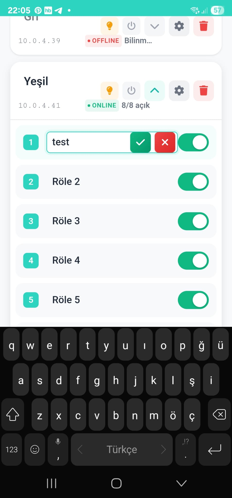

# Smart Lighting Control App

A modern .NET MAUI Blazor application for controlling Tasmota-based relay boards and smart lighting systems. Built with [TasmotaSharp](https://www.nuget.org/packages/TasmotaSharp/) library for seamless device communication.

This application was developed with the goal of creating a stable, robust ESP32 firmware solution for 2-channel and 8-channel relay boards. Tasmota proved to be an excellent choice for this purpose, providing reliable firmware with comprehensive HTTP API support.


## Language Support

**Multi-Language Interface**: The application supports both Turkish and English interfaces with real-time language switching.

- **Turkish (Türkçe)**: Full native support
- **English**: Complete interface translation
- **Language Switching**: Instant language changes through the dropdown menu in the header

The application uses [SMG Localization Generator](https://github.com/serkansmg/SMG.Localization.Generator) for efficient internationalization support, providing seamless language switching throughout the application.

## Hardware

The application is designed to work with ESP32-based relay boards, particularly the 8-channel WiFi Bluetooth relay board shown below:


### Recommended Hardware

**ESP32 WiFi Bluetooth 8-Channel Relay Board**
- ESP32-WROOM-32 module
- 8 independent relay channels (supports 2, 4, 6, 8 channel configurations)
- 5V/12V power input
- WiFi & Bluetooth connectivity
- Screw terminals for easy wiring

**Purchase Links:**
- [Direnc.net (Turkey)](https://www.direnc.net/esp32-wifi-bluetooth-8-kanal-role-karti)
- [AliExpress (International)](https://tr.aliexpress.com/item/1005006725015882.html?gatewayAdapt=glo2tur)

**Pin Configuration & Documentation:**
- [Complete Pin Mapping Guide](https://emariete.com/en/esp32-relay-board-x8)

**3D Printable Enclosure:**
- [STL Files for 8-Channel Board](https://makerworld.com/tr/models/374060-esp32-relay-board-cover-8-channel?from=search#profileId-274009)

## Features

- **Multi-Language Support**: Turkish and English interface with real-time language switching
- **Device Discovery**: Automatic mDNS discovery of Tasmota devices on your network
- **Multi-Device Management**: Control multiple relay boards from a single interface
- **Modern UI**: Beautiful modal dialogs for device addition with step-by-step wizards
- **Real-time Status**: Live monitoring of device connection status and relay states
- **WiFi Configuration**: Easy WiFi setup for new devices, including AP mode support
- **Individual Relay Control**: Toggle individual relays with instant feedback
- **Bulk Operations**: Turn all relays on/off with one tap
- **Device Settings**: Advanced configuration options for each device
- **Responsive Design**: Works seamlessly on mobile and desktop devices
- **Inline Editing**: Edit device and relay names directly in the interface
- **Smart Alerts**: Localized confirmation dialogs and notifications

## Screenshots

### Main Dashboard


*The main dashboard showing connected devices and their status*

### Device Discovery


*Automatic discovery of Tasmota devices on the network*

### Device Configuration
<div style="display: flex; gap: 10px; flex-wrap: wrap;">
  
  
</div>

*WiFi configuration and device settings interface*

### Relay Control
<div style="display: flex; gap: 10px; flex-wrap: wrap;">
  
  
  
</div>

*Individual relay control with real-time status updates*

## Why Tasmota?

This application was specifically designed to leverage Tasmota firmware as a stable, robust solution for ESP32-based relay control systems. Here's why Tasmota was chosen:

### Development Goals
- **Stability**: Need for reliable firmware that can handle continuous operation
- **Robustness**: Firmware that recovers gracefully from network issues and power cycles
- **Multi-Channel Support**: Seamless handling of both 2-channel and 8-channel relay configurations
- **HTTP API**: Comprehensive REST API for easy integration
- **Community Support**: Well-documented, actively maintained open-source project

### Tasmota Advantages
- **Proven Reliability**: Years of development and real-world testing
- **Self-Recovery**: Automatic WiFi reconnection and error handling
- **Extensive Features**: Built-in web interface, MQTT, timers, rules engine
- **Hardware Detection**: Automatic relay count detection and GPIO configuration
- **OTA Updates**: Easy firmware updates without physical access
- **mDNS Support**: Network discovery without hardcoded IP addresses

## Technology Stack

- **.NET 9 MAUI Blazor**: Cross-platform mobile and desktop application framework
- **TasmotaSharp**: HTTP-based Tasmota client library ([GitHub](https://github.com/serkansmg/TasmotaSharp))
- **SMG Localization Generator**: Source generator for multi-language support ([GitHub](https://github.com/serkansmg/SMG.Localization.Generator))
- **mDNS Discovery**: Automatic device discovery using Bonjour/Zeroconf
- **Preferences API**: Local device storage and configuration management
- **Modern CSS**: Custom responsive UI components with glassmorphism effects

## Getting Started

### Prerequisites

- .NET 9 SDK or later
- Visual Studio 2022 with MAUI workload
- Android/iOS development tools (for mobile deployment)

### Installation

1. Clone the repository:
```bash
git clone https://github.com/serkansmg/TasmotaMobileClient.git
cd TasmotaMobileClient
```

2. Install dependencies:
```bash
dotnet restore
```

3. Run the application:
```bash
dotnet run --framework net9.0-android  # For Android
dotnet run --framework net9.0-ios      # For iOS
dotnet run --framework net9.0-windows  # For Windows
```

## Usage

### Language Selection
- Use the language dropdown in the header to switch between Turkish and English
- Language preference is automatically saved and restored on app restart

### Adding New Devices

#### Automatic Discovery
1. Tap **"Device Discovery"** / **"Cihaz Keşfi"** on the main screen
2. Tap **"Start Scan"** / **"Taramayı Başlat"** to search for devices
3. Select discovered devices and tap **"Add"** / **"Ekle"** to add them to your dashboard

#### Manual Addition
1. Tap **"Manual Add"** / **"Manuel Ekle"**
2. A modern modal dialog will guide you through the process:
    - **Step 1**: Enter device name and IP address
    - **Step 2**: Automatic connection testing with visual progress
    - **Step 3**: Success confirmation with device details
3. The app will automatically detect relay count and current states

### Controlling Relays

#### Individual Control
- Tap the toggle switch next to each relay to turn it on/off
- Status updates in real-time with visual feedback
- Edit relay names by clicking on them directly

#### Bulk Control
- Use the lightbulb icon to turn all relays ON
- Use the power icon to turn all relays OFF

### Device Configuration

1. Tap the settings icon on any device card
2. Configure WiFi settings for new devices through an intuitive interface
3. Access advanced Tasmota features
4. Restart or reset devices with confirmation dialogs

## TasmotaSharp Integration

This application demonstrates practical usage of the TasmotaSharp library:

```csharp
// Initialize TasmotaClient
var client = new TasmotaClient();
client.SetIp(deviceIpAddress);

// Control relays
await client.SetRelayAsync(1, true);  // Turn relay 1 ON
var state = await client.GetRelayStateAsync(1);

// Device discovery
var relayCount = await client.GetRelayCountAsync();
var status = await client.GetStatusAsync();

// WiFi configuration
await client.SetWifiCredentialsAsync("NetworkSSID", "password");
await client.ScanWifiAsync();
```

### Key Features Used

- **Device Status Monitoring**: Real-time connection status checking
- **Relay Count Detection**: Automatic detection of available relays
- **WiFi Management**: Complete WiFi setup and configuration
- **mDNS Discovery**: Network-based device discovery
- **Bulk Operations**: Efficient multi-relay control

## Architecture

### Project Structure
```
SmartLightingApp/
├── Components/
│   ├── Pages/                       # Razor components
│   │   ├── Home.razor              # Main dashboard
│   │   ├── DeviceDiscovery.razor   # Device discovery page
│   │   ├── Settings.razor          # Device settings
│   │   ├── BoardCard.razor         # Device card component
│   │   ├── RelayItemPage.razor     # Individual relay control
│   │   ├── StatsCard.razor         # Statistics display
│   │   ├── ActionButtons.razor     # Action button components
│   │   └── Header.razor            # App header with language selector
│   ├── CustomComponents/           # Custom UI components
│   │   ├── EditableText.razor      # Inline text editing
│   │   └── ManualAddDeviceModal.razor # Device addition modal
│   └── Layout/                     # Layout components
├── Services/
│   ├── RelayDataService.cs         # Data persistence and language settings
│   └── TasmotaMdnsDiscoveryService.cs # mDNS discovery
├── Models/
│   ├── RelayBoard.cs               # Device models
│   └── RelayItem.cs
├── i18n/                           # Localization files
│   ├── General.en.json             # English translations
│   └── General.tr.json             # Turkish translations
└── Platforms/                      # Platform-specific code
```

### Localization System
The application uses **SMG Localization Generator** for efficient internationalization:

```csharp
// Usage in Razor components
@inject ILocalizationService Localization

// Accessing translations
@Localization.Current.General.Settings.Title

// Language switching
Localization.SetLanguage("en"); // or "tr"

// React to language changes
Localization.LanguageChanged += OnLanguageChanged;
```

### Data Flow
1. **Discovery Service** finds devices via mDNS
2. **TasmotaClient** communicates with devices
3. **Data Service** persists device configuration and language preferences
4. **UI Components** provide real-time updates with localized content

## Device Compatibility

### Supported Tasmota Devices
- ESP8266/ESP32 based relay boards
- Sonoff devices (Basic, 4CH, T1/T2/T3)
- Generic Tasmota firmware installations
- Custom relay configurations (2, 4, 6, 8 relays)

### Requirements
- Tasmota firmware 8.0+ recommended
- HTTP API enabled (default)
- Network connectivity (WiFi)
- mDNS support for auto-discovery

## Configuration

### Hardware Setup

#### 1. ESP32 Relay Board Setup
1. **Power Connection**: Connect 5V or 12V power supply to the board
2. **Relay Wiring**: Connect your loads (lights, motors, etc.) to relay outputs
3. **Safety**: Ensure proper electrical isolation and follow local electrical codes

#### 2. Tasmota Firmware Installation
1. Flash Tasmota firmware to your ESP32 device
2. After flashing, the device will appear as WiFi SSID `tasmota-xxxx`
3. Connect to this hotspot - the device's default IP is `192.168.4.1`
4. Access the web interface and go to **Configuration → Configure Module**
5. Set GPIO pins according to your relay board:
    - Configure GPIO pins as Relay 1, Relay 2, Relay 3, Relay 4, etc.
    - Use the pin mapping from [emariete.com guide](https://emariete.com/en/esp32-relay-board-x8)
6. Click **Save** - the device will restart with new configuration


*Example GPIO configuration for 8-channel relay board*

#### 3. Initial WiFi Setup

**Option 1: Manual Web Interface**
1. Power on the device
2. Connect to the `tasmota-xxxx` WiFi hotspot
3. Navigate to `192.168.4.1` in your browser
4. Go to **Configuration → Configure WiFi**
5. Select your network and enter credentials
6. Save and the device will restart and connect to your network

**Option 2: Using Smart Lighting App**
1. Power on the device
2. Connect to the `tasmota-xxxx` WiFi hotspot
3. Open the Smart Lighting App
4. Tap the gear icon (⚙️) in the top right corner
5. Use the app's WiFi scan and configuration features
6. Enter your network credentials through the app interface

#### 4. Enclosure (Optional)
- Print the 3D enclosure from [MakerWorld STL files](https://makerworld.com/tr/models/374060-esp32-relay-board-cover-8-channel?from=search#profileId-274009)
- Provides protection and professional appearance

### Device Setup
1. Flash Tasmota firmware to your ESP device
2. Configure basic WiFi settings
3. Enable mDNS (usually enabled by default)
4. Use the app to discover and add devices

### Network Requirements
- All devices should be on the same network subnet
- Multicast/mDNS traffic should be allowed
- Standard HTTP port (80) access required

## Troubleshooting

### Common Issues

**Device Not Found During Discovery**
- Ensure device is powered on and connected to WiFi
- Check that mDNS is enabled on the device
- Verify network connectivity

**Connection Timeout**
- Check IP address accuracy
- Ensure device is accessible via HTTP
- Try manual device addition using the modal wizard

**WiFi Configuration Fails**
- Verify WiFi credentials in the settings interface
- Check signal strength
- Ensure WPA2/WPA3 compatibility

**Language Issues**
- Language preferences are automatically saved
- Use the header dropdown to switch languages
- Restart the app if language changes don't persist

### Debug Mode
Enable debug logging in the app settings to troubleshoot connection issues.

## Contributing

1. Fork the repository
2. Create a feature branch (`git checkout -b feature/amazing-feature`)
3. Commit your changes (`git commit -m 'Add amazing feature'`)
4. Push to the branch (`git push origin feature/amazing-feature`)
5. Open a Pull Request

### Adding New Languages
1. Create new JSON files in the `i18n` folder (e.g., `General.de.json` for German)
2. Translate all keys from the existing English/Turkish files
3. Update the language selector in `Header.razor`
4. Test the translations thoroughly

## License

This project is licensed under the MIT License - see the [LICENSE](LICENSE) file for details.

## Dependencies

- [TasmotaSharp](https://www.nuget.org/packages/TasmotaSharp/) - Tasmota HTTP client library
- [SMGLocalization.SourceGenerator](https://www.nuget.org/packages/SMGLocalization.SourceGenerator/) - Source generator for localization
- [Makaretu.Dns.Multicast.New](https://www.nuget.org/packages/Makaretu.Dns.Multicast.New/) - mDNS discovery support

## Acknowledgments

- [Tasmota](https://tasmota.github.io/) project and community
- [TasmotaSharp](https://github.com/serkansmg/TasmotaSharp) library
- [SMG Localization Generator](https://github.com/serkansmg/SMG.Localization.Generator) for internationalization
- .NET MAUI team for the excellent cross-platform framework

---

**For more information about the libraries used:**
- **TasmotaSharp**: https://github.com/serkansmg/TasmotaSharp
- **SMG Localization Generator**: https://github.com/serkansmg/SMG.Localization.Generator
- **NuGet Packages**:
    - https://www.nuget.org/packages/TasmotaSharp/
    - https://www.nuget.org/packages/SMGLocalization.SourceGenerator/